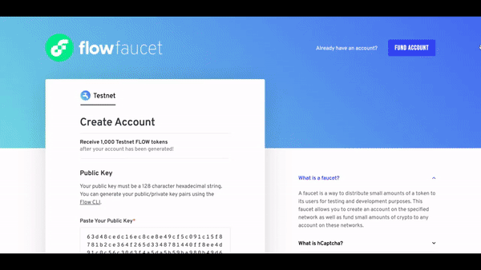
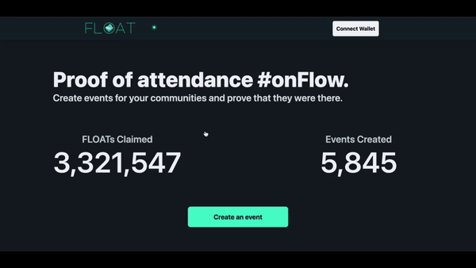

# Flow 101
The goal of this workshop is to learn about smart contracts and how to interact with them on Flow. This is very fundamental as a take your first steps on becoming a web3 developer! This knowledge will be helpful when building your own super cool dapps. 

## Challenge Overview
1. Create a Testnet Account
2. Sign the Flow Yearbook contract 

## What You'll Learn
1. Learn how to use Flow CLI for development
2. Create a testnet account on Flow
3. Send a transaction to sign the 'Flow Yearbook' to make it official!

## Prizes
- A soulbound proof-of-knowledge NFT for completing the quest. This special NFT will grant access to completion-gated channels in the official Flow Discord.

*Note: FLOATs are one of the platforms supported by Instagram, so if the feature has been rolled out to your account, you’ll be able to share your accomplishment with your friends, family and colleagues.*

## Before We Start 
Let's make sure we have our rulers and calculator ready for class! You'll need these two items on your computer before we dive in: 

#### 1. Git
You can follow the [GitHub guide]() on how to install Git. 

#### 2. Flow CLI
Visit the [Flow CLI Installation](https://developers.flow.com/tools/flow-cli/install) documentation & follow the instructions. You just need to run a single command in your terminal! If you already have it installed, make sure it’s the latest version.

## Step 0 - Clone the Repo (Optional)
This repo provides the completed contracts and scripts in order to complete the challenge. Alternatively, following along the steps below will teach you how to complete the challenge as well. It is recommended you follow the guide first to understand, then clone the repo 😊

```
git clone https://github.com/onflow/yearbook-workshop
```

## Step 1 - Start the Flow CLI
First things first, you will need to start the Flow CLI in order to use commands.
```javascript
flow init
```
You should see something like this: 
```Configuration initialized
Service account: 0xf8d6e0586b0a20c7

Start emulator by running: 'flow emulator' 
Reset configuration using: 'flow init --reset'
```

## Step 2 - Create your Testnet Account
Before we can sign the yearbook, we'll need our own account! Luckily for us, we just need to run a simple command with the Flow CLI.

#### 1. Create a Testnet Account
```javascript
flow accounts create
```

#### 2. Name your Account
Name your new account `hero` and follow the rest of the instructions on screen.

```
Enter an account name: hero
```
> 💡You can pick any name, we are trying to keep the instructions in line with your experience. If you would decide to name your account differently, please use that name everywhere we refer to `hero` account and address.
> 

#### 3. Set your network to Flow Testnet
```
Use the arrow keys to navigate: ↓ ↑ → ← 
? Choose a network: 
    Local Emulator
  ▸ Flow Testnet
    Flow Mainnet
```

#### 4. Save Account Info

```
✔ Flow Testnet

❗ This command will perform the following:
 - Generate a new ECDSA P-256 public and private key pair.
 - Save the private key to hero.private.json and add it to .gitignore.
 - Create a new account on Flow Testnet paired with the public key.
 - Save the newly-created account to flow.json.


? Do you want to continue? [y/N] y
```

#### 5. Fund your Testnet Account
```
Please complete the following steps in a web browser:
 1. Complete the captcha challenge.
 2. Click the 'Create Account' button.
 3. Return to this window.

✔ Press <ENTER> to open in your browser...: █
```

Once you press `<ENTER>`, your browser will be automatically directed to the [Flow Testnet Faucet](https://testnet-faucet.onflow.org/) with your account information **pre-populated**. 

The only actions that is required are: 

```
Please complete the following steps in a web browser:
 1. Complete the captcha challenge.
 2. Click the 'Create Account' button.
 3. Return to this window.

You can also navigate to the link manually: https://testnet-faucet.onflow.org/?key=<key_that_is_pre_populated>

Waiting for your account to be created, please finish all the steps in the browser...
```



#### 6. You're all set!

```
🎉 New account created with address 0xebeb17c521a0d375 and name hero.

Here’s a summary of all the actions that were taken:
 - Added the new account to flow.json.
 - Saved the private key to hero.private.json.
 - Added hero.private.json to .gitignore.
```

After you finish all the steps, you will notice that 2 new files. 
1) `hero.private.json` 
2) `flow.json`  

If you inspect the files, you should see the address and private key for your freshly minted account 👍!

## Step 3 - Class is in Session!

The official Flow Yearbook contract is deployed to Testnet. 
- Contract Address: [0x5593df7d286bcdb8](https://flow-view-source.com/testnet/account/0x5593df7d286bcdb8) 

You will be learning about Cadence, smart contracts, scripts and transactions, and how to execute in this section. Exciting!

#### 1. Init Account
First let's create our `init-account.cdc` file, open it and update the content with following Cadence code:

```javascript
import YearbookMinter from 0x5593df7d286bcdb8

transaction {
  prepare(signer: AuthAccount) {
    let yearbookExists = signer.getCapability(YearbookMinter.publicPath)
      .check<&YearbookMinter.Yearbook>()

    if(!yearbookExists){
      let book <- YearbookMinter.createYearbook(ownerAddress: signer.address)
      signer.save(<-book, to: YearbookMinter.storagePath)
      signer.link<&YearbookMinter.Yearbook>(YearbookMinter.publicPath, target: YearbookMinter.storagePath)
    }
  }
}
```

Now we will use the Flow CLI to send this transaction and sign it with our `hero` account
```bash
flow transactions send ./init-account.cdc --signer=hero --network=testnet
```
`--signer` flag will tell CLI to use your `hero`Avatar as a signer 

`--network` flag will specify which network we are interacting with - in this case `Testnet`

This step initiates your account so that you can call on the function to send your message to the yearbook.

#### 2. Get Available Messages

To protect the yearbook from any harmful “agents”, you will need to provide a message key instead of actual message. Let’s get a list of available keys.

Create a file `get-message-keys.cdc` and fill in Cadence code:

```javascript
import YearbookMinter from 0x5593df7d286bcdb8

pub fun main(): [String] {
  return YearbookMinter.allowedMessages.keys
}
```

Execute this script with:

```javascript
flow scripts execute ./get-message-keys.cdc --network=testnet
```

This shall give you a following list of keys:

```javascript
"hello": "Hello"
"bff": "You are the best friend anyone could ask for!"
"cya": "See you around"
"gator": "Later, aligator!"
"fun": "You make my life fun!"
```

You can pick any of those, when leaving a message in Flow’s Yearbook.

#### 3. Sign the Yearbook
In order to sign someone the Flow Yearbook, you will need to sign a specifically designed transaction. 

* Flow Yearbook Testnet Address: `0x5593df7d286bcdb8` 


Create a `leave-message.cdc` and paste the following code there:

```javascript
import YearbookMinter from 0x5593df7d286bcdb8

transaction(yearbookOwner: Address, messageKey: String){
    prepare(signer: AuthAccount){
        let yearbookReference = getAccount(yearbookOwner)
            .getCapability(YearbookMinter.publicPath)
            .borrow<&YearbookMinter.Yearbook>()
            ?? panic(YearbookMinter.errNoYearbook)

        yearbookReference.leaveMessage(signer: signer.address, messageKey: messageKey)
    }
}
```
This transaction takes two arguments: 
- `yearbookOwner` - the address of the Yearbook owner we are trying to modify
- `messageKey` - the message key we’ve just discussed

We have initialized our account with Yearbook, so you can leave us a message wtih `fun` message key:

```javascript
flow transactions send ./leave-message.cdc 0x5593df7d286bcdb8 fun --signer=hero --network=testnet 
```

#### 3. Read Messages from Yearbook

### Get Yearbook Messages

Additionally you can also read all previous messages left by other heroes - both from your and other accounts.

Create `get-yearbook-messages.cdc` file and populate it with Cadence code:

```bash
import YearbookMinter from 0x5593df7d286bcdb8

pub fun main(owner: Address): {Address: String}{
    let yearbookReference = getAccount(owner)
        .getCapability(YearbookMinter.publicPath)
        .borrow<&YearbookMinter.Yearbook>() 
        ?? panic(YearbookMinter.errNoYearbook)
    
    return yearbookReference.messages
}
```

Let’s check our Yearbook and see who left messages there:

```bash
flow scripts execute ./get-yearbook-messages.cdc 0x5593df7d286bcdb8 --network=testnet 
```

You should be able to see a list of addresses and corresponding messages, they have left in our Yearbook. 

You can also update that `0x5593df7d286bcdb8` to your own address - which can be found within `hero.private.json` file and check who left messages in your Yearbook.


## Step 4 - Mainnet Account
In order for us to deliver your FLOATs, you will need to provide us your Mainnet account address. The easiest way is via [Float City](https://floats.city/) webpage - which will also help to initialize your account with FLOAT Collection.

*If you want to share it on your Instagram, choose Dapper as your wallet selection*

1. Visit [https://floats.city](https://floats.city) 
2. Click on “Connect Wallet” 
3. Login with the wallet of your choice (choose wisely! This is where you will receive your FLOAT!)
4. Click on the address
5. Copy the Address from the “Account” tab (this is your mainnet account!)


## Step 5 - You made it! 👏

Congratulations on sending your first transactions on Testnet and utilizing Flow CLI commands! You're well on your way to becoming a proficient developer on Flow. In order to receive your FLOAT, please fill out the form with the following information: 

- Testnet Account Address (to verify your work)
- Mainnet Account Address (to receive the FLOAT)
- Email Address (so we can reach out for SWAG!)

[Please fill out the form here](https://share.hsforms.com/1ouJ1prrSR566_ZuB9krH5Q3u4gy)

*Verification process will be automatically processed every week and you can expect to see your FLOAT in your account within a week's time of your form submission*
